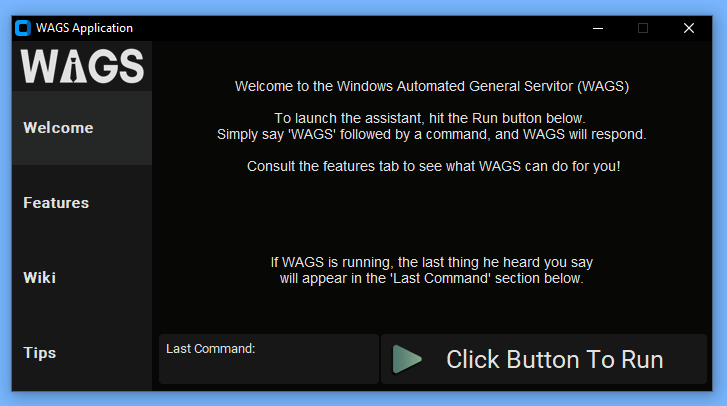

    <picture>
        <source media="(prefers-color-scheme: dark)" srcset="./assets/images/WAGS_logo.png">
        
    </picture>
     
    <i> Windows Automated General Servitor </i>

---
## Description

Windows Automated General Servitor (WAGS) is a python-powered application that
aids in use of the Windows operating system. It aims to simplify the use of
a Windows computer by offering essential system features. These features can be accessed by running the built-in voice assistant. The assistant must first be started through the green play button located on the bottom of the application, then you can ask the assistant to perform a command by saying:

"Hey WAGS [command]"

WAGS will not respond to a command unless you say his name first.

---

## Installation
The installation process is as follows: 
1. Download the contents of this repository as a zip
2. Right click the zip folder and select "Extract all..." then select where you want the unzipped folder to be located
3. Inside the now unzipped folder, go to the AppWAGS folder and find the 'WAGS.exe' file
4. Right click this file and select 'Create shortcut'
5. Drag this newly created shortcut anywhere on your device
6. Simply double click the shortcut file you just moved and WAGS will launch!

---

## How To Use
Below is an image of each different tab that can be viewed within the app, along with an explanation below each image:
 
 

 
The welcome page is what first appears when the application is launched. It gives a general description of the app and basic use.
 
 
 
 

 
The features page gives a description over every feature that comes with WAGS. Each feature is split into its own section, and can be viewed by scrolling through the feature page. The features include: greeting, open/close applications, searching topic through wikipedia, managing notes, and turning off the computer.
 
 
 
 

 
This is the page where the wikipedia information requested by the user will appear. To populate this page with a wikipedia page, ask WAGS to "search" or "look up" your topic. If WAGS has confirmed that your information has been added to the page, but you do not see it, simply click the 'Wiki' tab button to refresh the page.
 
 
 
 

 
The tips page contains useful tips on how to increase your knowledge surrounding the use of a Windows computer. Using the tips listed here combined with WAGS functionality can aid greatly in the basic use of a Windows computer.